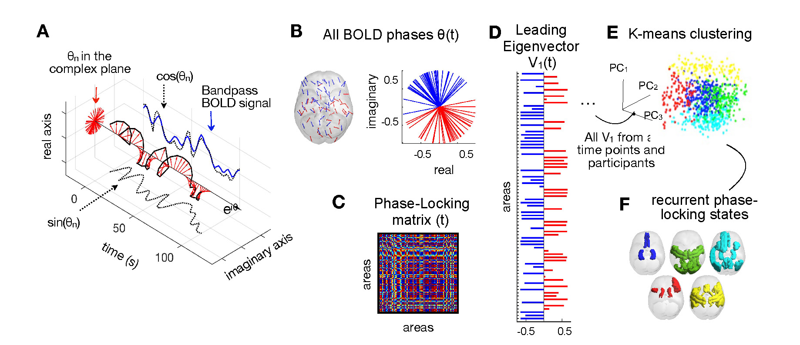

# LEiDA_DELTA_RECURRENCE_PIPELINE

Matlab code to run leading eigenvector dynamics analysis (LEiDA) as described in Alonso et al. 2023. "Segregation of dynamic resting-state reward, default mode and attentional networks after remitted patients transition into a recurrent depressive episode", based on code developed by Joana Cabral.

## Summary

We investigated how the brain’s dynamical repertoire changes after patients transition from remission to recurrence of a new depressive episode.

Recurrent patterns of functional connectivity were characterized by applying leading eigenvector dynamics analysis (LEiDA). Within-subject differences between baseline and follow-up were identified for the 11 non-remitted patients (i.e., paired t-test between baseline scan at remission and follow-up scan at recurrence). Seventeen matched-remitted patients (i.e., patients in remission at baseline and follow-up scanning sessions) were used as a validation dataset.

## Script Steps

1. Read the BOLD data from the folders and compute the BOLD phases.
   - Calculate the instantaneous BOLD synchronization matrix.
   - Compute the Leading Eigenvector at each frame from all fMRI scans.

2. Cluster the Leading Eigenvectors into recurrent Functional Networks

3. Analyze the Clustering results.
   - For every fMRI scan, calculate the Fractional occupancy (P) and lifetimes (LT) of each state c.

4. Test the statistical significance of within-subject changes in P and LT.

### Input Data

ts_data.mat contains the timeseries for each subject and session

### Figure: Detection of recurrent phase-locking (PL) patterns in fMRI signals

A) The fMRI signal is band-pass filtered between 0.01–0.1 Hz (blue) and Hilbert transformed into an analytic signal, whose phase can be represented over time (eiθ black arrow) and at each TR (red arrows). B) The phases in all N = 80 regions at a single TR are represented in the complex plane (right) and cortical space (left; arrows are placed at the centre of gravity of each region n; the direction and colour of the arrows indicate the sign of the corresponding element in the leading eigenvector V1(n,t) (red for positive and blue for negative). C) The PL matrix captures the phase alignment between each pair of regions. D) The leading eigenvector of the PL matrix at time t, V1(t) captures the main orientation of all phases. E) The leading eigenvectors obtained for each time point are concatenated over scans and subjects, and fed into a k-means clustering algorithm which divides the pool of data points into a predefined number of clusters k. F) Cortical representation of the PL-states (clusters). PL = phase-locking (right).

---
